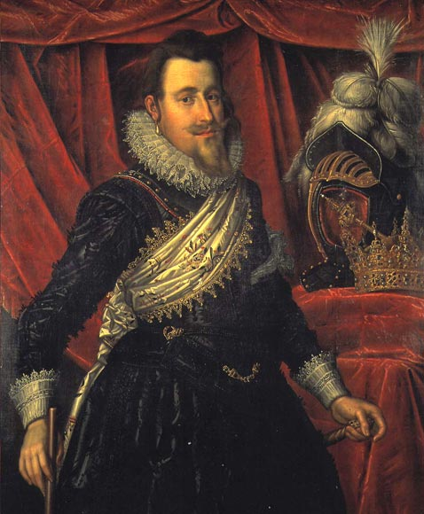

# Our Danish Ancestry #

## Denmark

Denmark in the 1940's was basically under German rule. Christian IV, or Christian den Fjerde in Danish was who  lived from 1577 - 1648, was a monarch of the German House of Oldenburg who ruled as king of Denmark-Norway and Duke of Holstein and Schleswig from 1588 to 1648.    His reign of 59 years is the longest of all Danish monarchs, and the longest of all the Scandinavian monarchies.

Christian began his personal rule of Denmark in 1596 at the age of 19. He is frequently remembered as one of the most popular, ambitious, and proactive Danish kings, having initiated many reforms and projects. Christian IV obtained for his kingdom a level of stability and wealth that was virtually unmatched elsewhere in Europe. He engaged Denmark in numerous wars, most notably the Thirty Years' War (1618–48), which devastated much of Germany, undermined the Danish economy, and cost Denmark some of its conquered territories. He renamed the Norwegian capital Oslo as Christiania after himself, a name used until 1925.

